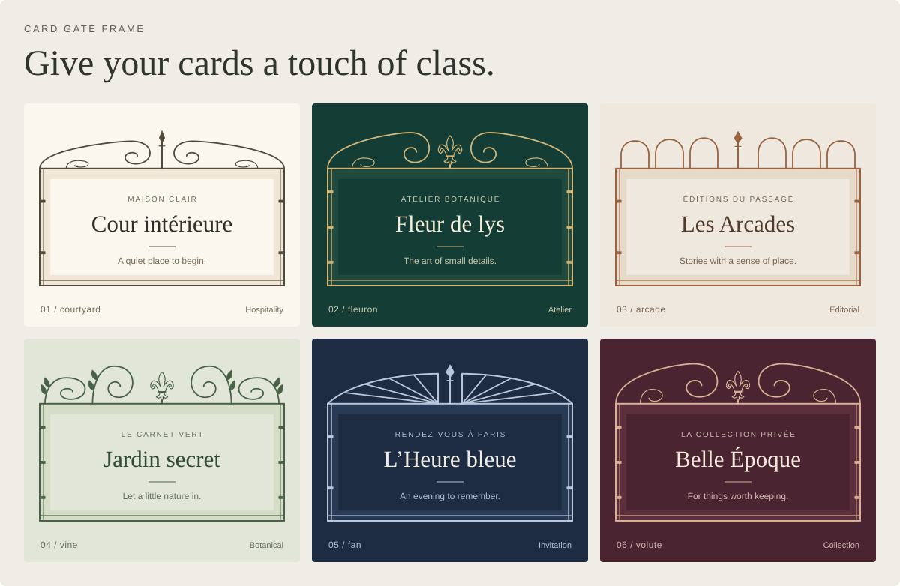

# Card Gate Frame

[](docs/assets/readme-demo.svg)

Deterministic ornamental SVG frames for prepared HTML containers, with a DOM-free geometry generator, TypeScript declarations, and zero runtime dependencies.

Package version 1.0.0 includes three generation algorithms. Use explicit `generationVersion: 3` for French ironwork across the `courtyard`, `fleuron`, `arcade`, `vine`, `fan`, and `volute` families. Generation 2 offers alternate compositions; omitting `generationVersion` selects the original courtyard algorithm (generation 1). Equal version, seed, dimensions, options, and paint reproduce equal output.

## Installation

Install with:

```sh
pnpm add card-gate-frame
```

## Browser quick start

Gate Frame uses the target's existing padding as the content-safe region; it does not add padding or change the target's outer dimensions.

```html
<article id="card" class="card">
  <h2>Courtyard notes</h2>
  <button type="button">Open</button>
</article>
```

```css
.card {
  box-sizing: border-box;
  position: relative;
  max-width: 960px;
  min-height: 25rem;
  padding: 8.5rem 2.375rem 2.375rem;
}
```

```ts
import { gateFrame } from "card-gate-frame";

const controller = gateFrame("#card", {
  seed: "lyon-42",
  family: "courtyard",
  density: 0.58,
  curvature: 0.72,
  stroke: "#20221e",
  surface: "rgba(143, 119, 79, 0.12)",
});

await controller.whenReady();
```

Select generation 3 for French ironwork and its additional controls:

```ts
controller.destroy();

const workshop = gateFrame("#card", {
  generationVersion: 3,
  seed: "lyon-42",
  family: "fan",
  crest: "diamond",
  density: 0.58,
  curvature: 0.72,
  symmetry: 0.86,
  peakHeight: 0.48,
  sideComplexity: 0.64,
});

await workshop.whenReady();
```

The exact minimum padding is reported by generated `contentInsets` and varies with the measured size and options. The DOM adapter compares those physical insets with computed padding and reports `GateFrameInsufficientSpaceError` instead of obscuring content. When padding changes without a box resize, call `controller.update({})` to re-check it.

Generated frames support widths of 160–1600 CSS pixels, heights of 96–1200 CSS
pixels, and a `width / height` ratio of 0.5–6, all inclusive. For the DOM adapter,
these are the target's padding-box dimensions, excluding its borders. Keep the
target within those bounds; an out-of-range size reports `UNSUPPORTED_DIMENSIONS`.

## DOM-free core

```ts
import { generateGate, renderGateSVG } from "card-gate-frame/core";

const geometry = generateGate(
  { width: 640, height: 360 },
  { seed: "lyon-42", family: "courtyard", generationVersion: 1 },
);

const svg = renderGateSVG(geometry, {
  stroke: "#20221e",
  surface: "#d6c4a1",
});
```

`card-gate-frame/core` has no DOM globals or DOM declaration requirement.

## Targets and cleanup

The current adapter supports exactly `div`, `article`, `section`, and `aside` elements when they are measurable horizontal-writing-mode containers, including block, inline-block, flex, and grid containers. Other element types, replaced elements, restricted form controls, table internals, inline or `display: contents` targets, fragmented or vertical-writing targets, and shadow hosts are rejected. Pass an element directly for a supported target inside an open shadow root.

The imperative overlay is appended as the target's last child. Avoid framework-owned targets or CSS that depends on direct-child structural selectors such as `:empty` or `:last-child`. The overlay is hidden from accessibility APIs and ignores pointer input, but application content still owns its focus styles.

```ts
controller.update({ density: 0.7 });
await controller.whenReady();
const svg = controller.toSVG();
controller.destroy(); // Idempotent; removes owned DOM, observers, and style changes.
```

The controller API is deliberately small:

| Method | Result |
| --- | --- |
| `status()` | Current pending, ready, error, or destroyed state. |
| `whenReady()` | Resolves to the next committed snapshot or rejects with its typed error. |
| `update(options)` | Atomically replaces the provided options and schedules a render. |
| `randomize(seed?)` | Chooses or applies a seed and returns it. |
| `snapshot()` | Returns the last committed immutable snapshot, or `null`. |
| `toSVG()` | Serializes the committed frame; throws before readiness or after destroy. |
| `destroy()` | Idempotently releases every resource owned by the controller. |

Failures extend `GateFrameError` and expose stable codes: `INVALID_SELECTOR`,
`TARGET_NOT_FOUND`, `TARGET_NOT_HTML_ELEMENT`, `UNSUPPORTED_TARGET`,
`POSITIONING_CONFLICT`, `ALREADY_MOUNTED`, `INVALID_OPTIONS`,
`UNSUPPORTED_DIMENSIONS`, `INSUFFICIENT_CONTENT_SPACE`, `NOT_READY`, and
`DESTROYED`.

## Compatibility constraints

Both entry points are safe to import during server rendering, but `gateFrame()`
requires a browser DOM when called. Use `card-gate-frame/core` for generation on a
server or worker.

The DOM adapter has no network or external stylesheet requirement. It does set
inline positioning styles on its owned SVG and, when needed, the target; a CSP
that forbids all style attributes is therefore incompatible with this adapter.

Framework users should mount through a host-element ref after the framework has
created the element, and call `destroy()` before that host is unmounted. Gate
Frame does not provide framework adapters in this release and appends its SVG as
the host's last child, so framework code must tolerate that owned child.

The package is ESM-only and targets ES2022. Release tests use Playwright 1.63.0 with Chromium 153.0.8010.12, Firefox 155.0, and WebKit 26.6. Other branded browsers and previous versions are outside the verified matrix.

## Example

The repository includes an interactive six-family example. Run `pnpm install --frozen-lockfile` and `pnpm dev` from a source checkout.

The showcase above uses real generation 3 output. Download the [SVG](docs/assets/readme-demo.svg), [PNG](docs/assets/readme-demo.png), or [individual example cards and raw frames](docs/assets/examples). The card copy, typography, and backgrounds illustrate possible uses; the library generates the ornamental frames. Run `pnpm demo:readme` to regenerate all assets, or `pnpm demo:readme --svg-only` for SVGs without launching a browser.

MIT licensed; see LICENSE.
